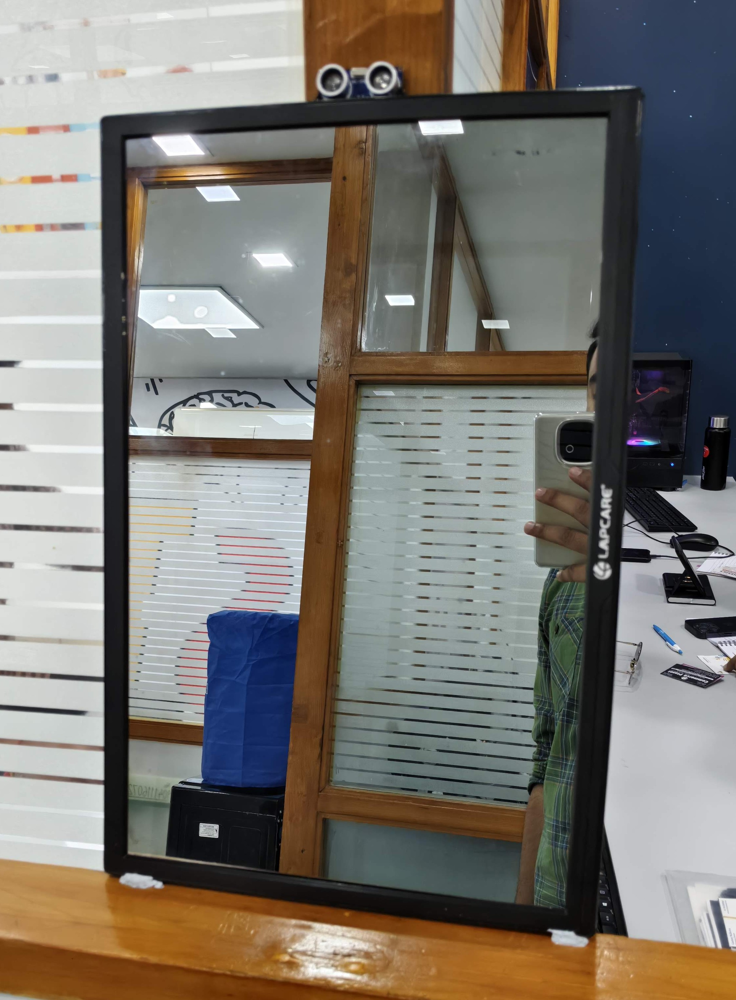

# 🪞 Smart Mirror

A custom-built Smart Mirror powered by **Electron**, displaying real-time **weather**, **news**, **chatbot** interaction, and responsive UI using an **IR proximity sensor**. This project is designed for seamless, touchless interaction in a modern home or workspace.

---

## 📸 Project Snapshot

> *(Insert real-life image of your smart mirror below)*

 <!-- Replace with your actual image path -->

---

## ⚙️ Features

- 🕒 **Live Clock**: Real-time digital clock (24-hour format)
- 🌦️ **Weather Module**: Current temperature, humidity, wind speed, and condition
- 📰 **News Feed**: Auto-scrolling top headlines from Indian news sources
- 💬 **Voice & Text Chatbot**: AI assistant powered via webhook
- 👁️ **IR Sensor UI Toggle**: Automatically hides UI when no user is present
- 🎞️ **Animated Bot Status**: GIF animations for idle, listening, thinking, and error states
- 🖥️ **Fullscreen Kiosk Mode**: Optimized for Raspberry Pi or any desktop display
- 🖱️ **Mouse Hidden**: Cursor hidden for a clean mirror interface

---

## 🧱 Technologies Used

- [Electron.js](https://www.electronjs.org/) – for building the desktop app
- [Node.js](https://nodejs.org/) – backend logic and APIs
- [Axios](https://axios-http.com/) – HTTP client for API requests
- [Weatherstack API](https://weatherstack.com/) – current weather data
- [Mediastack API](https://mediastack.com/) – news headlines
- [n8n](https://n8n.io/) – no-code automation + webhook for chatbot
- HTML, CSS, and JavaScript for frontend

---

## 🛠️ Setup Instructions

### 📦 Prerequisites

- Node.js and npm installed
- Git (optional but recommended)
- Electron globally or locally installed

---

### 🔧 Installation

```bash
git clone https://github.com/your-username/smart-mirror.git
cd smart-mirror
npm install
